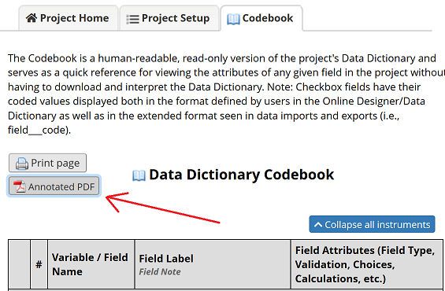
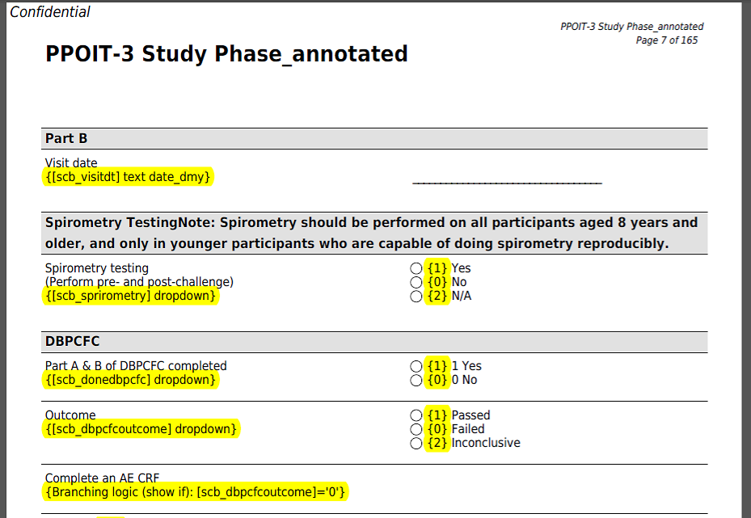

********************************************************************************
# Annotated CRF

Luke Stevens, Murdoch Children's Research Institute https://www.mcri.edu.au

********************************************************************************
## Summary

This module adds a button, "Annotated PDF", to the project Codebook page. Click it to download an all-forms PDF file (blank) with metadata annotations.

## Annotations

Annotations appear beneath each field's label in the PDF within curly brackets {}:
* Variable name
* Field type (including "required" and/or "identifier" as applicable)
* Text validation type and min/max (if applicable)
* Branching logic

Also annotated are the values for dropdown and radio fields:
* Each choice label has the corresponding value prepended within curly brackets.

## Screenshots
### Design/data_dictionary_codebook.php

### PDF Annotations

********************************************************************************
